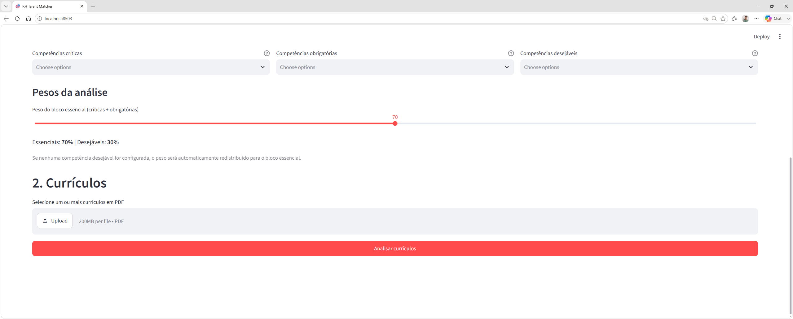

## 📸 Demonstração

### ⚙️ Configuração da vaga

O recrutador pode definir o cargo, descrição da vaga e separar as competências em críticas, obrigatórias e desejáveis.

---

### ⚖️ Pesos e seleção de currículos

O sistema permite ajustar os pesos da análise e carregar vários currículos em PDF.

---

### 🏆 Ranking de aderência

Após o processamento, os candidatos são classificados conforme sua aderência aos requisitos da vaga.

---

### 🔎 Análise individual

O sistema apresenta recomendação, classificação, pontos fortes, lacunas e competências identificadas.

