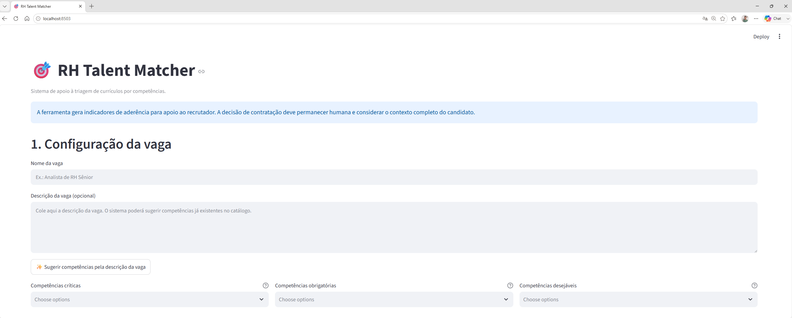
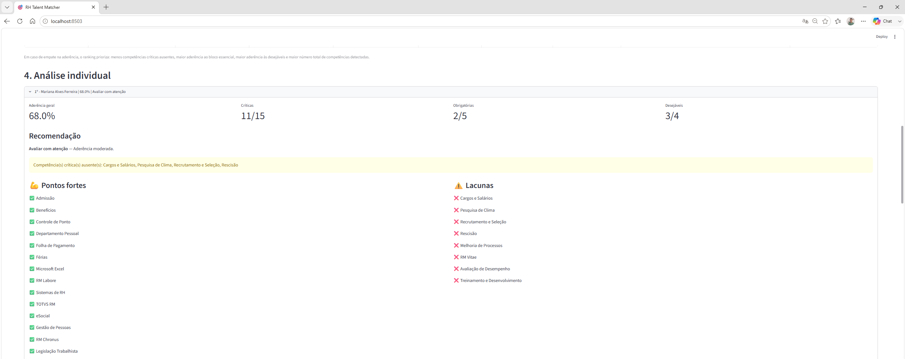
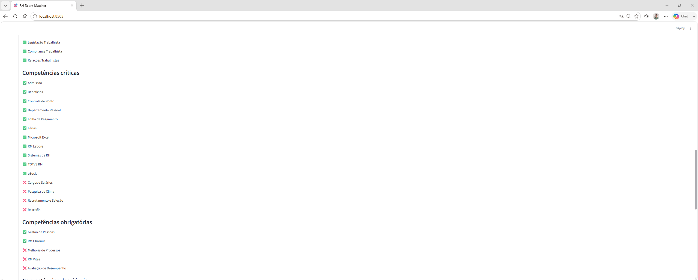
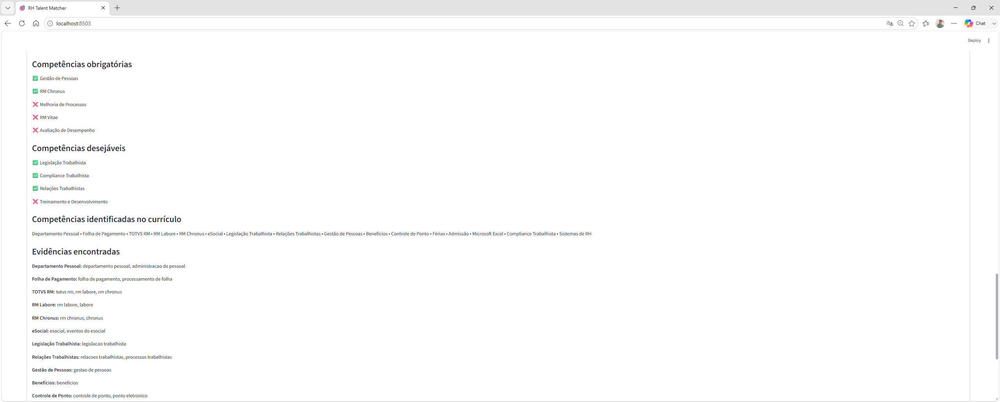
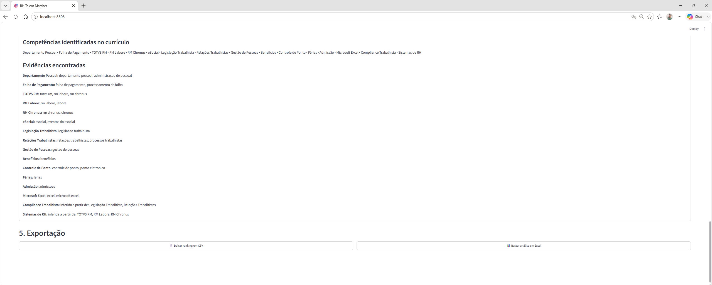

## 📸 Demonstração

### ⚙️ Configuração da vaga

O recrutador pode definir o cargo, descrição da vaga e separar as competências em críticas, obrigatórias e desejáveis.

---

### ⚖️ Pesos e seleção de currículos

Os pesos da análise podem ser configurados antes do processamento dos currículos.

---

### 🏆 Ranking de aderência

Após a análise, o sistema gera automaticamente o ranking dos candidatos considerando aderência, competências críticas, obrigatórias e desejáveis.

---

### 🔎 Análise individual do candidato

Cada candidato possui uma análise detalhada com recomendação, classificação, pontos fortes, lacunas e competências identificadas.

